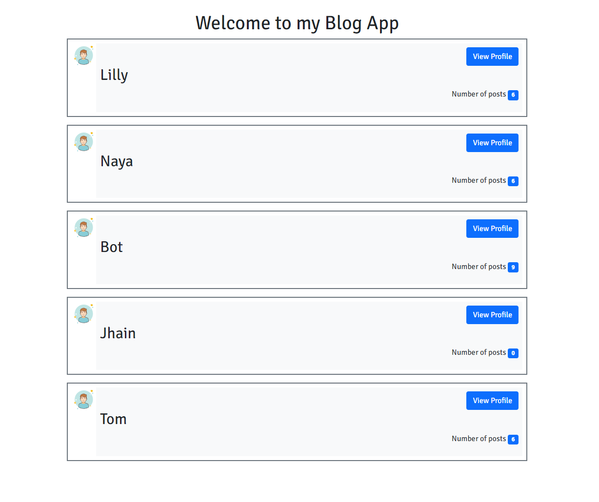
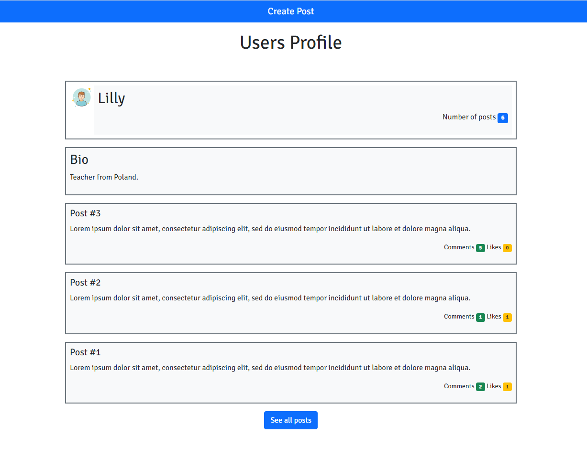
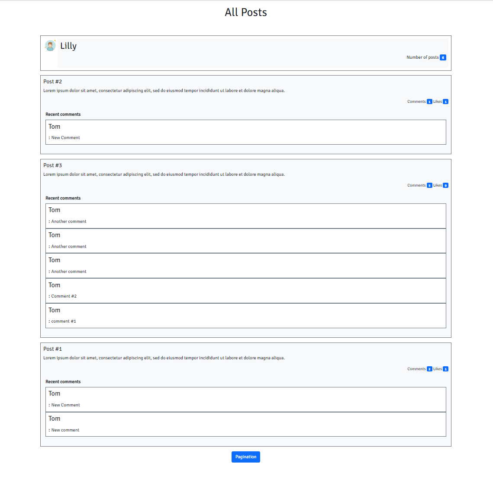
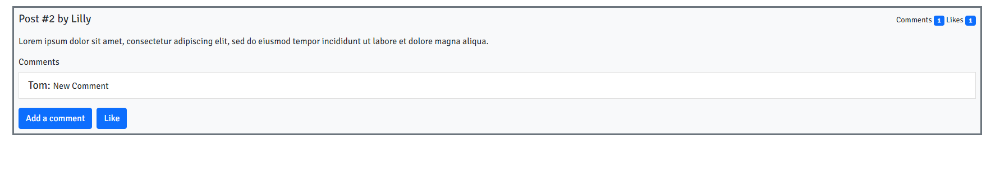

# Blog_App_With_Rails
This Blog app is a classic example of a blog website. I will be creating a full functional website that will show the list of posts and empower readers to interact with them by adding comments and liking posts.

## Milestone-1
- For each URL you should create:
  - A route.
  - An action in the correct controller.
  - A view file.
- View files should include only placehoulders written in plain HTML, e.g:
  - Here is a list of post for a given user

## Milestone-2
- Add RSpec as a gem to your project.
- Create a Request spec file for all your controllers.
- Make sure that for each action you check:
  - If response status was correct.
  - If a correct template was rendered.
  - If the response body includes correct placeholder text.

## Milestone-3
- Build your project schema.
  - Create and run the necessary migration files.
  - Table and column names should match the ERD diagram.
    - note: photo for users table should be a link to an image
  - Foreign keys should be included.
  - All columns that are foreign keys should have a corresponding index.

## Milestone-4
You should include some additional methods.
- Users
  - A method that returns the 3 most recent posts for a given user.
- Posts
  - A method that updates the posts counter for a user.
  - A method which returns the 5 most recent comments for a given post.
- Comments
  - A method that updates the comments counter for a post.
- Likes
  - A method that updates the likes counter for a post.

## Milestone-5
- Implement the design from the sneak peek wireframes.
  - Styling is nice to have but focus on making sure everything functions first.
- Use methods that you have created in the [Blog App - processing data in models](https://github.com/microverseinc/curriculum-rails/blob/main/blog-app/projects/Processing_data_model_project.md).
- Hint: In order to see some posts or comments, you might need to add some data to your database as described [here](https://github.com/microverseinc/curriculum-rails/blob/main/blog-app/projects/Processing_data_model_project.md#use-models-to-insert-data).

## Milestone-6
- Create forms to perform the following functions:
  - Create a Post on behalf of the current_.user.
  - Create a comment on behalf of the current_user.

## Mileston-7
- Add the following validations:
  - For the User model:
    - Name must not be blank.
    - PostsCounter must be an integer greater than or equal to zero.
  - For the Post model:
    - Title must not be blank.
    - Title must not exceed 250 characters.
    - CommentsCounter must be an integer greater than or equal to zero.
    - LikesCounter must be an integer greater than or equal to zero.
- Add unit specs for all of your models' methods and validations.
- Add flash messages in the create actions in all your controllers.
- Make sure that the N+1 problem is solved when fetching all posts and their comments for a user.

## Clone Project
- STEP 1:
  - git clone `git@github.com:oluyaratosin123/Blog_App_With_Rails.git`
- STEP 2:
  - `cd Blog_App_With_Rails` in your terminal
- STEP 3:
  - run `rails server` or `rails s` in your terminal
- STEP 4:
  - visit `localhost:3000` on your browser
> Yeyyy you have the app running **Congratulations** 😅🎉

## Run test suits
  > rspec spec

## Technologies Used
* Language (Ruby on Rails)
* PostgreSQL

## Installation
* Ruby
* Rails
* Postgresql

## 👤 Author 
Edward Yara :student: 
- GitHub: [@oluyaratosin123](https://github.com/oluyaratosin123)
- Twitter: [@TOluyara](https://twitter.com/TOluyara)
- LinkedIn: [LinkedIn](https://www.linkedin.com/in/edward-oluyara/)

## Contributing :handshake:
Contributions, issues, and feature requests are welcome!

## Show your support
Give a 	:star: if you like this project.

## Acknowledgments
* Hat tip to anyone whose code was used
* Inspiration
* etc

## License :memo:
This project is [MIT](https://github.com/microverseinc/readme-template/blob/master/MIT.md) licensed
